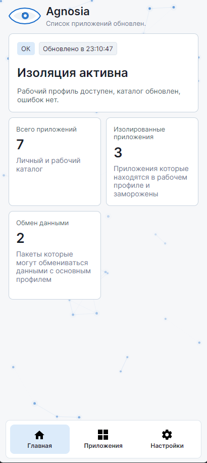
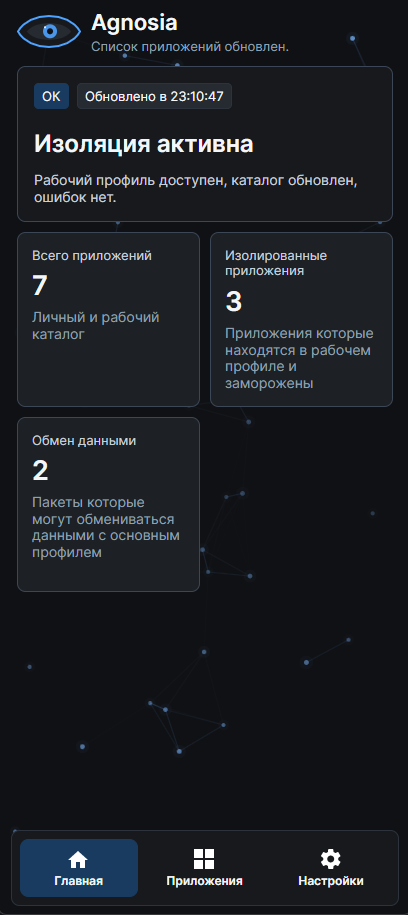
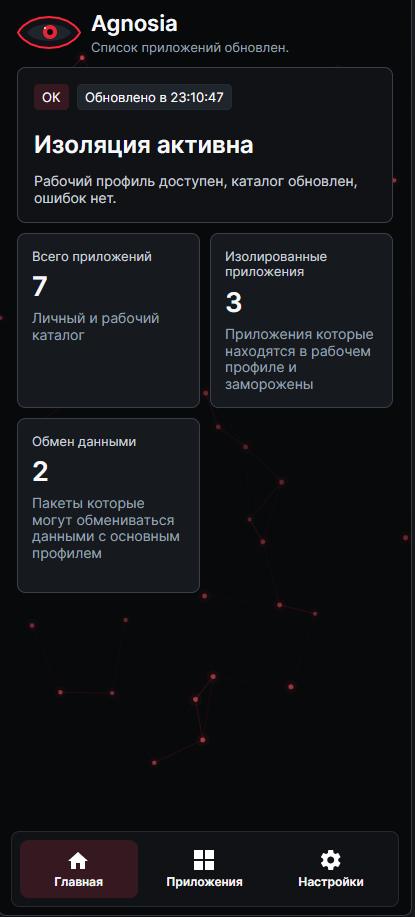
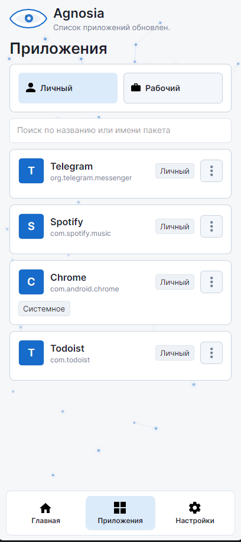
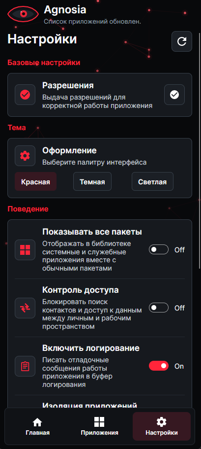

  

<h1 align="center">Agnosia</h1>

**Agnosia** - утилита для изоляции Android-приложений в рабочем профиле.

С каждым годом всё больше приложений желает залезть в личную жизнь пользователя как можно глубже. А потом продать эти данные или использовать против него же.

Особенно актуально для приложений, которые сложно или невозможно просто удалить - по рабочим, личным или региональным причинам. Например, это могут быть MAX, VK, Яндекс.

Но собирать данные может и обычное приложение для снижения веса. Разница лишь в том, как эти данные будут использованы.

## Что делает Agnosia

- Ограничение фоновой активности приложений
- Изоляция приложений от личных данных пользователя
- Снижение видимости основного Android-окружения
- Скрытие факта использования VPN от приложений в рабочем профиле
- Отдельная среда для потенциально нежелательных приложений
- Экономия энергии за счёт ограничения фоновой работы

## Для чего это нужно

Рабочий профиль даёт приложениям отдельную среду, а Agnosia помогает сделать так, чтобы приложения внутри этого профиля находились в забвении: меньше видели, меньше знали и меньше влияли на основную систему.

Название проекта отсылает к агнозии - нарушению восприятия, при котором человек может видеть объект, но не способен его распознать. Здесь идея похожая: приложения продолжают работать, но теряют возможность полноценно узнавать пользователя, его устройство и окружение.

## Важно

Agnosia не является абсолютной защитой и не заменяет осторожность. Она не защитит от данных, которые вы сами передаёте приложению или сервису.

Цель проекта - уменьшить доступ приложений к данным и упростить изоляцию нежелательного ПО.

Лучший способ защититься от приложения, которому вы не доверяете, - **удалить его**. Agnosia нужна для тех случаев, когда удалить приложение нельзя или неудобно, но оставлять его в основном профиле тоже не хочется.

## Требования

- Android 12+ (API 31)
- Поддержка создания рабочих профилей на устройстве

## Планы на будущее

- Поддержка большего количества клиентов VPN
- Улучшение автозаморозки приложений
- Режим охлаждения для выбранных приложений (Не полной заморозки)
- Описание принципа работы для пунктов из настроек

Скриншоты приложения

  
  
  

  
  

## Полезные ссылки

- [Habr: Цифровая тень: аудит популярных Android-приложений](https://habr.com/ru/articles/1029004/)
- [Habr: MAX и реверс-инжиниринг приложения](https://habr.com/ru/articles/1006666/)
- [Habr: Зачем Яндекс.Браузеру эти данные?](https://habr.com/ru/articles/878236/)
- [RKS Global: российские приложения ищут VPN](https://files.rks.global/russian_apps_search_for_vpn_ru.pdf)
- [Privacy International: Meta and Yandex break security to save their business model](https://privacyinternational.org/long-read/5621/meta-and-yandex-break-security-save-their-business-model)
- [RKS Global: Проверка бесплатных VPN: кому уходят данные](https://rks.global/ru/research/freevpns/)
- [Shelter](https://github.com/petercxy/shelter)
- [Anubis](https://github.com/sogonov/anubis)
