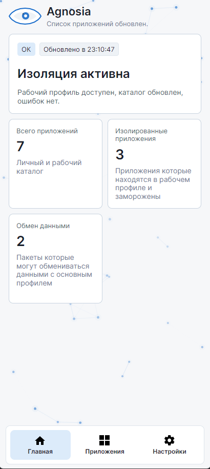
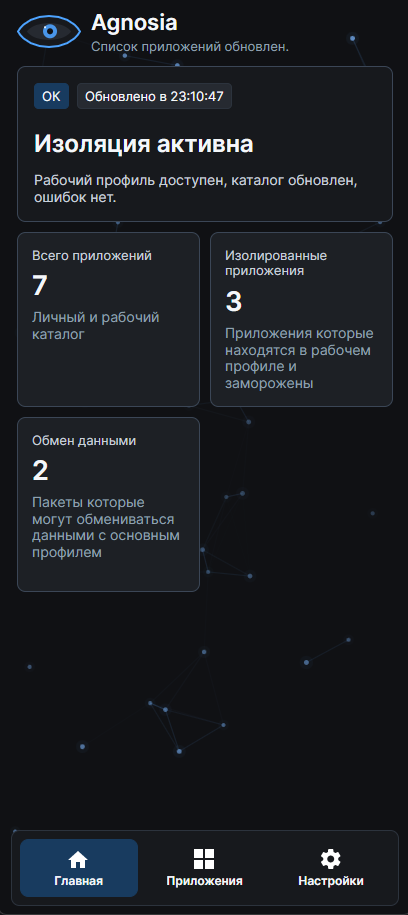
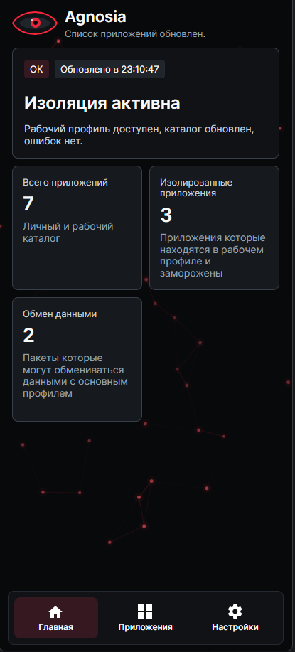
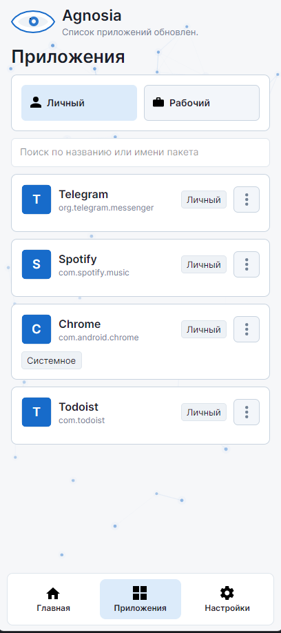
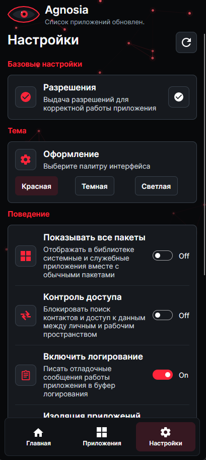

  

<h1 align="center">Agnosia</h1>

  <strong>required ≠ trusted</strong>

  
  
  

  
  
  

<strong>Скриншоты интерфейса</strong>

 

  
  &nbsp;
  
  &nbsp;
  

  
  &nbsp;
  

## О проекте

**Agnosia** — Android-приложение для изоляции программ, которым вы не хотите давать постоянный доступ к основному профилю устройства.

Приложения запускаются в отдельном **рабочем профиле Android**, изолированном от основного профиля, его приложений и значительной части пользовательских данных.

Это позволяет оставить нужное приложение доступным, но ограничить его постоянное присутствие в основном окружении устройства.

## Возможности

| Возможность                  | Что даёт                                                          |
| ---------------------------- | ----------------------------------------------------------------- |
| **Изоляция приложений**      | Запуск приложений в отдельном рабочем профиле                     |
| **Автоматическая заморозка** | Ограничение работы приложения после использования                 |
| **Анализ разрешений**        | Помогает оценить потенциально чувствительные разрешения           |
| **Контроль разрешений**      | Отзыв разрешений у приложений рабочего профиля                    |
| **Скрытие VPN**              | Снижает возможность определения VPN приложениями рабочего профиля |
| **Передача файлов**          | Обмен файлами между основным и рабочим профилями                  |
| **Контроль фоновой работы**  | Ограничение ненужной фоновой активности                           |
| **Экономия энергии**         | Снижение расхода батареи неиспользуемыми приложениями             |

<strong>Пример: изоляция приложения MAX</strong>

 

Рассмотрим приложение **MAX** в качестве примера.

При обычной установке возможности приложения определяются Android, выданными разрешениями, прошивкой устройства и реализацией самого приложения.

При запуске через Agnosia приложение находится в рабочем профиле и отделено от приложений и данных основного профиля. Дополнительные механизмы Agnosia позволяют ограничивать его фоновую активность и доступ к отдельным возможностям устройства.

| Возможность                                     |    Обычная установка   |            С Agnosia           |
| ----------------------------------------------- | :--------------------: | :----------------------------: |
| Фоновая работа и фоновые задачи                 |        Доступно        |         **Не доступно**        |
| Автозапуск компонентов                          |        Доступно        |         **Не доступно**        |
| Взаимодействие с приложениями основного профиля |        Доступно        |         **Не доступно**        |
| Определение приложений на устройстве            |        Доступно        |   **Только рабочий профиль**   |
| Определение VPN                                 |        Доступно        |         **Не доступно**        |
| Доступ к сетевому окружению                     |        Доступно        |       **Во время работы**      |
| Проверка доступности сайтов и сервисов          |        Доступно        |       **Во время работы**      |
| Определение публичного IP / оператора           |        Доступно        |       **Во время работы**      |
| Доступ к фото и видео основного профиля         |        Доступно        |         **Не доступно**        |
| Доступ к контактам основного профиля            |        Доступно        |         **Не доступно**        |
| Камера и микрофон в фоне                        |        Доступно        |       **Во время работы**      |
| Геолокация в фоне                               |        Доступно        |       **Во время работы**      |

> Конкретное поведение зависит от версии Android, прошивки устройства, выданных разрешений и самого приложения.

## Документация

* [Руководство пользователя](.docs/user_space.md)
* [Техническое описание](.docs/tech_space.md)

## Требования

* Android 12+ — API 31 и выше
* Поддержка создания рабочего профиля на устройстве

## Материалы

Исследования и публикации о поведении мобильных приложений, трекинге и приватности:

* [Habr — Цифровая тень: аудит популярных Android-приложений](https://habr.com/ru/articles/1029004/)
* [Habr — MAX и реверс-инжиниринг приложения](https://habr.com/ru/articles/1006666/)
* [Habr — Зачем Яндекс.Браузеру эти данные?](https://habr.com/ru/articles/878236/)
* [Habr — 15 вещей, которые вы бы не хотели знать о мессенджере MAX](https://habr.com/ru/articles/1036222/)
* [RKS Global — Российские приложения ищут VPN](https://files.rks.global/russian_apps_search_for_vpn_ru.pdf)
* [Privacy International — Meta and Yandex break security to save their business model](https://privacyinternational.org/long-read/5621/meta-and-yandex-break-security-save-their-business-model)
* [InterSecLab — An Analysis of Russia’s State-Mandated Messaging Application](https://interseclab.org/research/max/)
* [USENIX Security — Bridges to Self: Silent Web-to-App Tracking on Mobile via Localhost](https://www.usenix.org/system/files/usenixsecurity26-vlummens.pdf)

 

  
    Agnosia — это <strong>дополнительный уровень изоляции</strong>, а не абсолютная защита. 
    Она не скрывает данные, которые вы самостоятельно передаёте приложению или связанному с ним сервису:
    номер телефона, адрес электронной почты, переписку, загруженные файлы и другую предоставленную вами информацию.
  

